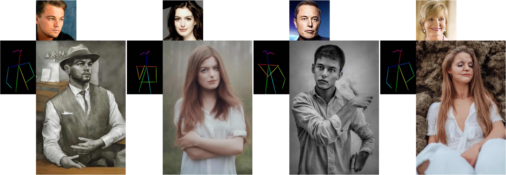
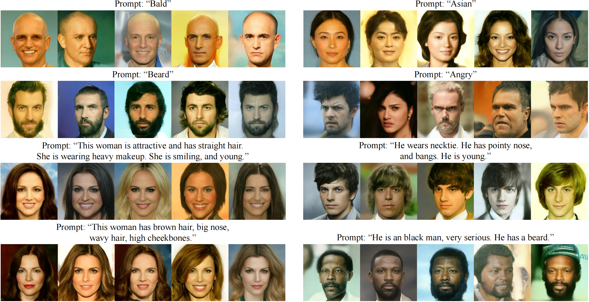
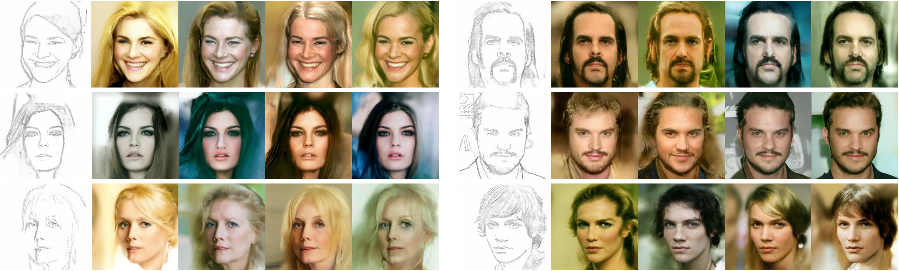
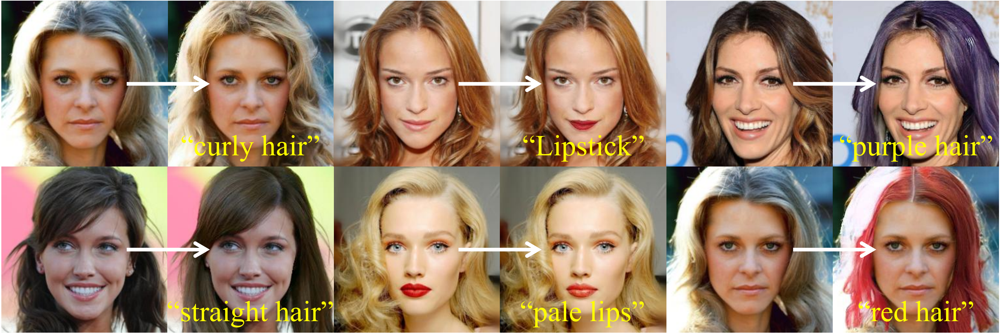

<div align="center">
<h1>FreeDoM 🕊️ (ICCV 2023)</h1>
<h3>FreeDoM: Training-Free Energy-Guided Conditional Diffusion Model</h3>

[Jiwen Yu](https://vvictoryuki.github.io/website/)<sup>1</sup>, [Yinhuai Wang](https://wyhuai.github.io/info/)<sup>1</sup>, [Chen Zhao](https://scholar.google.com/citations?user=dUWdX5EAAAAJ)<sup>2</sup>, [Bernard Ghanem](https://www.bernardghanem.com/)<sup>2</sup>, [Jian Zhang](https://jianzhang.tech/)<sup>1</sup>

<sup>1</sup> Peking University, <sup>2</sup> KAUST

[](https://arxiv.org/abs/2303.09833)
[](https://openaccess.thecvf.com/content/ICCV2023/papers/Yu_FreeDoM_Training-Free_Energy-Guided_Conditional_Diffusion_Model_ICCV_2023_paper.pdf)
[](https://openaccess.thecvf.com/content/ICCV2023/supplemental/Yu_FreeDoM_Training-Free_Energy-Guided_ICCV_2023_supplemental.pdf)

</div>

## News

- **_News (2023-10-06)_**: We successfully shared our work in Paris, thank you all for communicating with us! 😎 
- **_News (2023-08-17)_**: We have released the main code. The details of ControlNet-related code can be found in `./CN` while the details of the human face and guided diffusion-related code can be found in `./Face-GD`
- **_News (2023-07-16)_**: We have released the code for FreeDoM-SD-Style, and you can find detailed information in the directory of `./SD_style`
- **_News (2023-07-14)_**: 🎉🎉🎉 Congratulations on FreeDoM being accepted by ICCV 2023! Our open-source project is making progress, stay tuned for updates!

## Todo

- [x] release the the camera-ready version of the paper and supplementary materials
- [x] release the code for human face diffusion models and guided diffusion with various training-free guidances
- [x] release the code for ControlNet with training-free face ID guidance and style guidance
- [x] release the code for Stable Diffusion with training-free style guidance 

## Introduction


FreeDoM is a **simple but effective training-free** method generating results under control from various conditions using unconditional diffusion models. Specifically, we use off-the-shelf pre-trained networks to construct the time-independent energy function, which measures the distance between the given conditions and the intermediately generated images. Then we compute the energy gradient and use it to guide the generation process. FreeDoM **supports various conditions**, including texts, segmentation maps, sketches, landmarks, face IDs, and style images. FreeDoM **applies to different data domains**, including human faces, images from ImageNet, and latent codes. 

## Overall Experimental Configurations

| Model Source                                                 | Data Domain        | Resolution               | Original Conditions           | Additional Training-free Conditions                | Sampling Time*(s/image) |
| ------------------------------------------------------------ | ------------------ | ------------------------ | ----------------------------- | -------------------------------------------------- | ----------------------- |
| [SDEdit](https://github.com/ermongroup/SDEdit)               | aligned human face | $256\times256$           | None                          | parsing maps, sketches, landmarks, face IDs, texts | ≈20s            |
| [guided-diffusion](https://github.com/openai/guided-diffusion) | ImageNet           | $256\times256$           | None                          | texts, style images                                | ≈140s           |
| [guided-diffusion](https://github.com/openai/guided-diffusion) | ImageNet           | $256\times256$           | class label                   | style images                                       | ≈50s            |
| [Stable Diffusion](https://github.com/CompVis/stable-diffusion) | general images     | $512\times512$(standard) | texts                         | style images                                       | ≈84s            |
| [ControlNet](https://github.com/lllyasviel/ControlNet)       | general images     | $512\times512$(standard) | human poses, scribbles, texts | face IDs, style images                             | ≈120s           |

*The sampling time is tested on a GeForce RTX 3090 GPU card.

## Results

<details>
    <summary>Training-free <strong>style</strong> guidance + <strong>Stable Diffusion</strong> (click to expand) </summary>
    
</details>

<details>
    <summary>Training-free <strong>style</strong> guidance + Scribble <strong>ControlNet</strong> (click to expand)</summary>
    
</details>

<details>
    <summary>Training-free <strong>face ID</strong> guidance + Human-pose <strong>ControlNet</strong> (click to expand)</summary>
    
</details>

<details>
    <summary>Training-free <strong>text</strong> guidance on <strong>human faces</strong> (click to expand)</summary>
    
</details>

<details>
    <summary>Training-free <strong>segmentation</strong> guidance on <strong>human faces</strong> (click to expand)</summary>
    
</details>

<details>
    <summary>Training-free <strong>sketch</strong> guidance on <strong>human faces</strong> (click to expand)</summary>
    
</details>

<details>
    <summary>Training-free <strong>landmarks</strong> guidance on <strong>human faces</strong> (click to expand)</summary>
    
</details>

<details>
    <summary>Training-free <strong>face ID</strong> guidance on <strong>human faces</strong> (click to expand)</summary>
    
</details>
<details>    <summary>Training-free <strong>face ID</strong> guidance + <strong>landmarks</strong> guidance on <strong>human faces</strong> (click to expand)</summary>
    
</details>

<details>    <summary>Training-free <strong>text</strong> guidance + <strong>segmentation</strong> guidance on <strong>human faces</strong> (click to expand)</summary>
    
</details>

<details>
    <summary>Training-free <strong>style transferring</strong> guidance + <strong>Stable Diffusion</strong> (click to expand)</summary>
    
</details>

<details>
    <summary>Training-free <strong>text-guided</strong> face editting (click to expand)</summary>
    
</details>

## Acknowledgments

Our work is standing on the shoulders of giants. We want to thank the following contributors that our code is based on:

- open-source pre-trained diffusion models:
  - (human face models) https://github.com/ermongroup/SDEdit
  - (ImageNet mdoels) https://github.com/openai/guided-diffusion
  - (Stable Diffusion) https://github.com/CompVis/stable-diffusion
  - (ControlNet) https://github.com/lllyasviel/ControlNet
- pre-trained networks for constructing the training-free energy functions:
  - (texts, style images) https://github.com/openai/CLIP
  - (face parsing maps) https://github.com/zllrunning/face-parsing.PyTorch
  - (sketches) https://github.com/Mukosame/Anime2Sketch
  - (face landmarks) https://github.com/cunjian/pytorch_face_landmark
  - (face IDs) [ArcFace(https://arxiv.org/abs/1801.07698)](https://arxiv.org/abs/1801.07698)
- time-travel strategy for better sampling:
  - (DDNM) https://github.com/wyhuai/DDNM
  - (Repaint) https://github.com/andreas128/RePaint

We also introduce some recent works that shared similar ideas by updating the clean intermediate results $\mathbf{x}_{0|t}$:

- concurrent conditional image generation methods:
  - https://github.com/arpitbansal297/Universal-Guided-Diffusion
  - https://github.com/pix2pixzero/pix2pix-zero
- zero-shot image restoration methods:
  - (DDNM) https://github.com/wyhuai/DDNM
  - (DDRM) https://github.com/bahjat-kawar/ddrm
  - (Repaint) https://github.com/andreas128/RePaint
  - (DPS) https://github.com/DPS2022/diffusion-posterior-sampling

## Citation

If this work is helpful for your research, please consider citing the following BibTeX entry.

```
@article{yu2023freedom,
title={FreeDoM: Training-Free Energy-Guided Conditional Diffusion Model},
author={Yu, Jiwen and Wang, Yinhuai and Zhao, Chen and Ghanem, Bernard and Zhang, Jian},
journal={Proceedings of the IEEE/CVF International Conference on Computer Vision (ICCV)},
year={2023}
}
```


