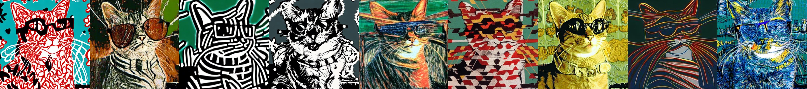

# FreeDoM-SD-Style

This repo is designed to add FreeDoM-based style control to [Stable Diffusion](https://github.com/CompVis/stable-diffusion), a famous text-to-image generative model. In other words, FreeDoM-SD-Style supports two conditional inputs: one is the native text input for Stable Diffusion, and the other is the style input supported by FreeDoM.

## Installation

##### Environment

You can directly use the conda environment for Stable Diffusion. Please refer to the configuration instructions provided [here](https://github.com/CompVis/stable-diffusion).

##### Pre-trained Model

You can download the model weights (SD-v1-4) from [here](https://huggingface.co/CompVis) and then place them in this directory (`models/ldm/stable-diffusion-v1/model.ckpt`).

## Quick Start

Just run `bash run.sh`, you will get the following results.

(The prompt is "a cat wearing glasses." and style references are different.)

